Tutorial
****************

Setup
=============

If you ran the following command when installing CaImAn:

``python caimanmanager.py install --inplace``

then there should be a directory called **example_movies** in the CaImAn folder. In this folder,
there should be a file called **demoMovie.tif**. For this tutorial, we will use this movie for analysis,
though you can use an imaging movie you choose.

Activate the environment you pip installed CaImAn, Napari, Napari-1d, mesmerize-core, and mesmerize-napari
within by running the following command:

``source activate <name of environment>``

Then, in the terminal run the following:

``napari``

The napari software should launch, opening the following window:

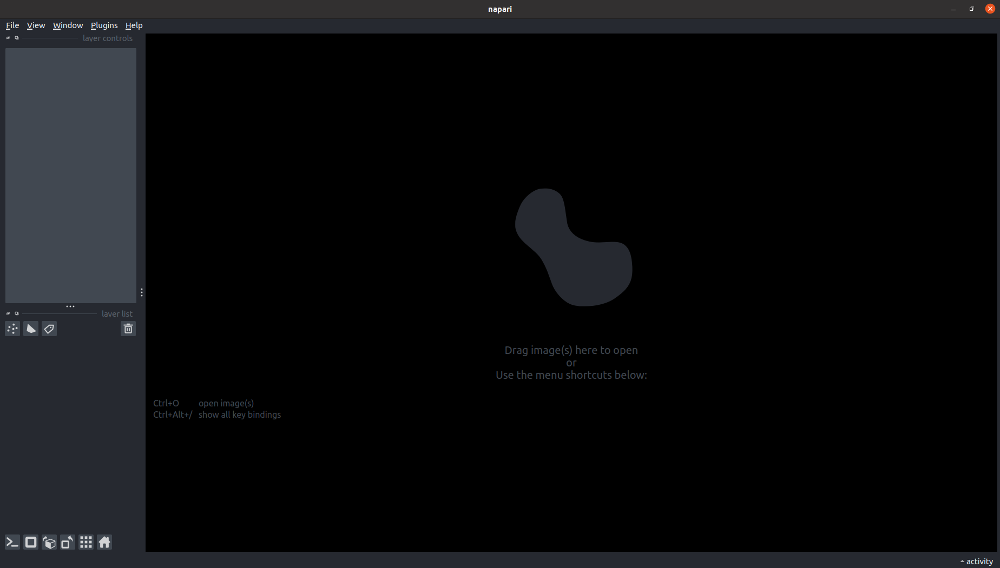

Click on the **plugin** tab, and select **Mesmerize: Main Offline GUI**

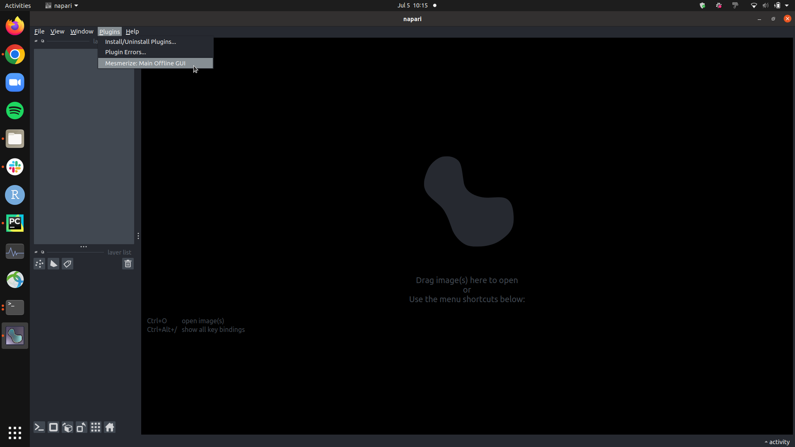

You should see the following when you click the mesmerize plugin

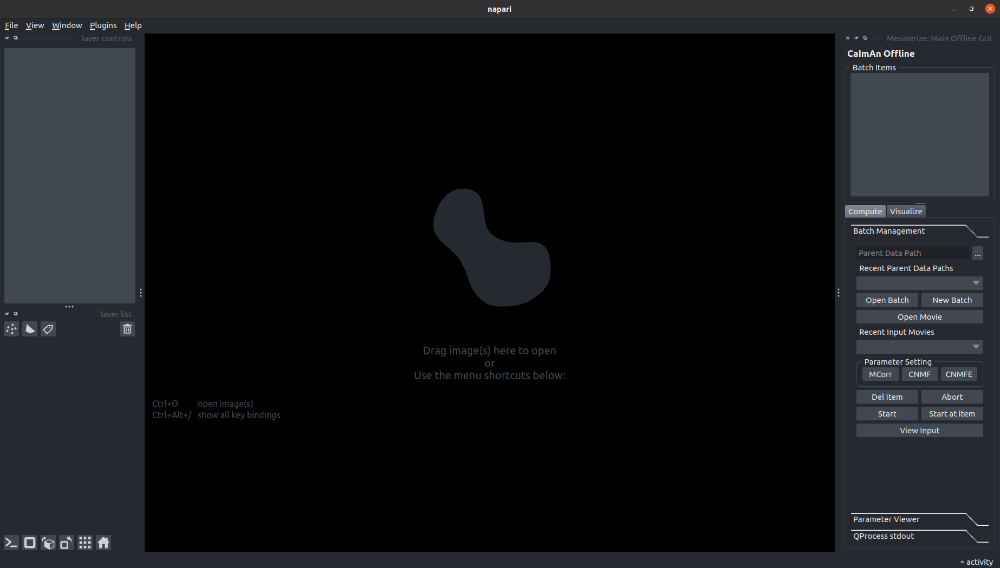

The first thing you should do is define your parent data path. The reason we necessitate defining a parent
data path is for the following scenario:

If you are analysing the same movies on multiple devices - let's call them Computer A and Computer B - then you
will likely be using the same file organization system to manage the movies you wish to analyse. Let's say your movies
are recorded in multiple sessions - *session_1*, *session_2* - and are stored in the directory
**example_movies**. In this case, all movies in session_1 are located in *./example_movies/session_1/*. In both
Computer A and Computer B, this file system **/example_movies/** is the same, but the path leading to the
directory **/example_movies/** will differ. To reference movies within Session 1 in Computer A,
the full path may be */home/computer_A/example_movies/session_1/*, while in Computer B it may be
*/home/computer_B/example_movies/session_1/*. To ensure the same file system **/example_movies/** can be reliably
used between both computer, we will set the parent data path of Computer A to **/home/computer_A/** and the
parent data path of Computer B to **/home/computer_B/**. As a result, the relative path of each movie to the
**/example_movies/** directory is preserved without being affected by differences in the parent directory.

To set the parent data path, do the following:

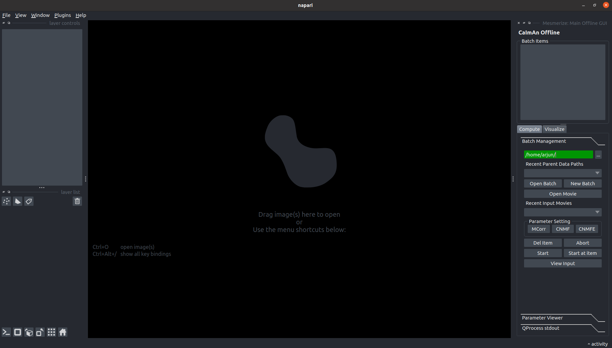

**NOTE:** The text box will turn green when the parent data path is valid, and red when it is invalid.

Next, open a new batch by clicking the following button:

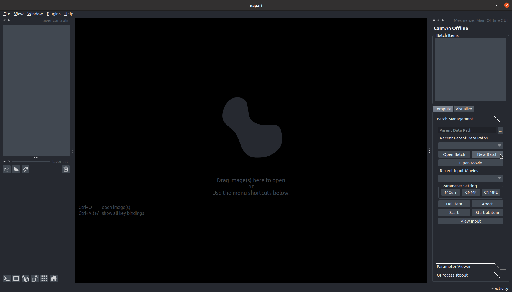

A window will launch allowing you to choose a directory to store the batch file (.pikl) within.
Make sure to choose a directory that comes *after* the parent directory.

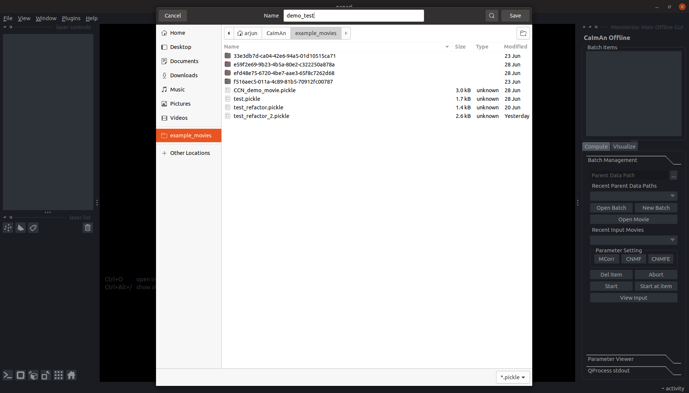

Once you've created a new batch, select an input movie to use. In this case, we will use the
demoMovie.tif from the example_movies folder. To select a movie, click the **Input Movie** button:

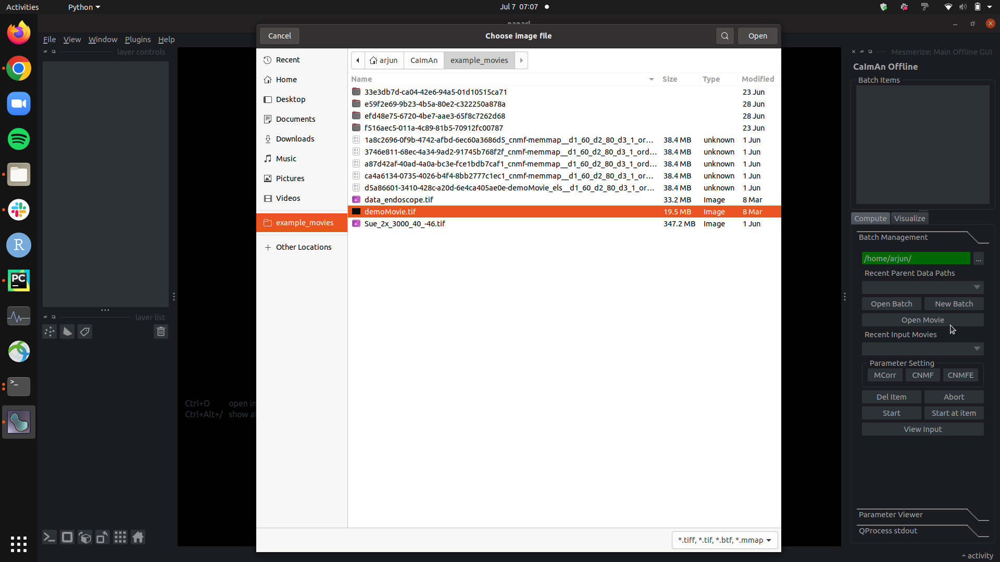

Once you've selected a movie, you should also see the combo box below *Recent Input Movies* has
updated to contain the path to the input movie file.

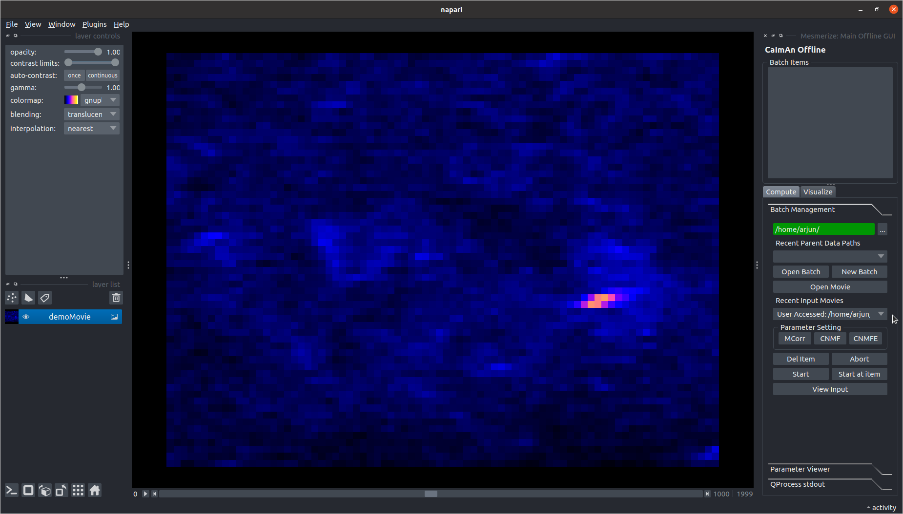

This will allow you to quickly set the
input movie path for each process (MCORR, CNMF(E)) you want to run. For now, the most recently
opened movie will be the input movie path used for a process you create, so no change is necessary.

Motion Correction (MCORR)
========================

Now, we can add some motion correction (MCORR) items to run. To add an MCORR item, click the **MCORR**
button under *Parameter Settings*. It will launch a separate window as shown below.

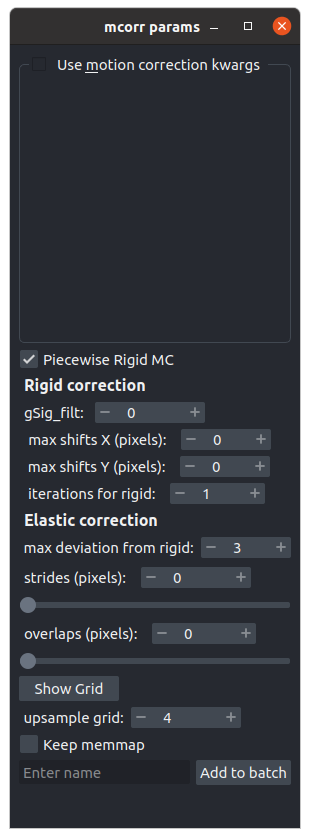

We can define the parameters needed for motion correcting the demo movie as shown below. Once
the parameters are set, we can choose a name to identify this item with, and click the **Add to Batch**
button.

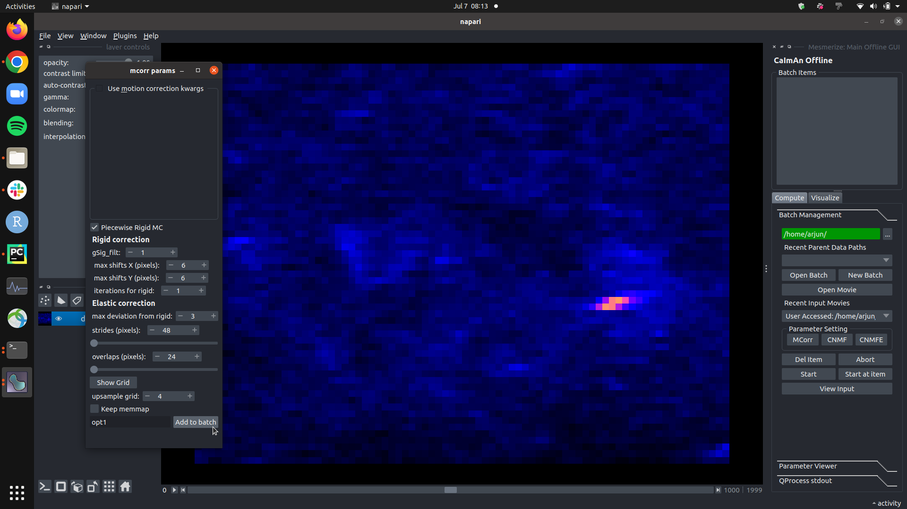

Clicking the button will result in the Batch Items Box in the main gui to have an item added. Selecting
the item in the main gui, and opening the **Parameter Viewer** below allows you to see the parameters you've
defined for a given item (in this case, the motion correction item).

Since the purpose of this batch system is to test out multiple hyperparameter options, we will add a second
item with different parameters. Specifically, we will make this option use rigid motion correction, where
before we used nonrigid (piecewise) motion correction.

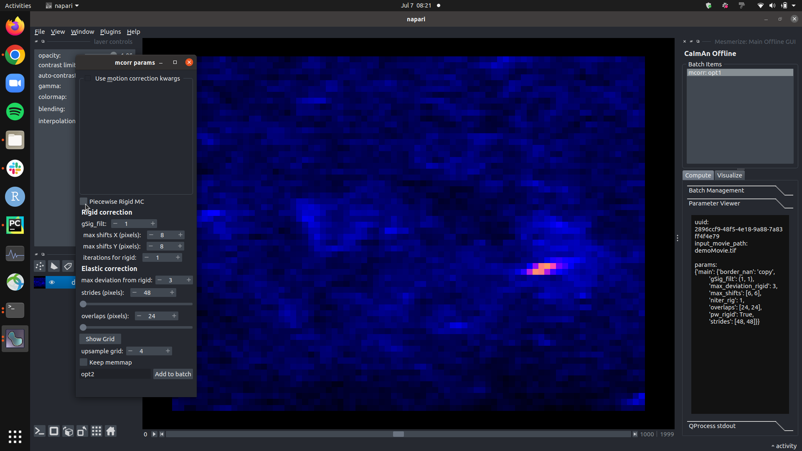

You can see that if select the second mcorr item in the **Batch Items** list, the **Parameter Viewer**
will display the parameters defined uniquely for the selected item.

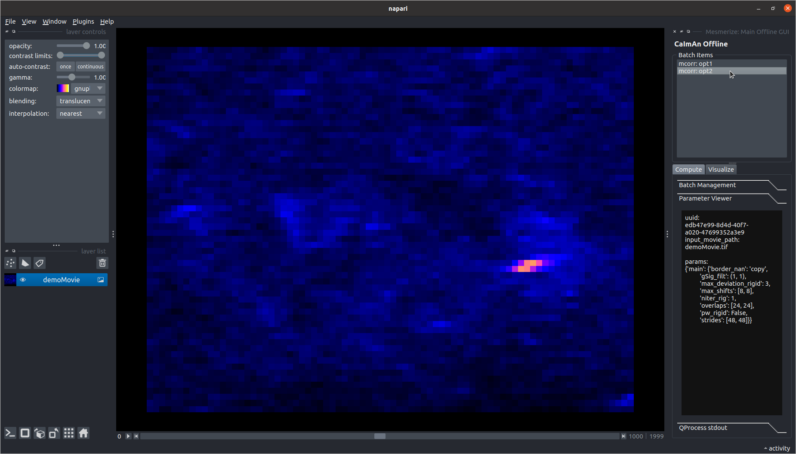

To run all batch items, simply click the **Start** button in the **Batch Management** tab. When you do so,
the first item in the batch will turn yellow in colour.

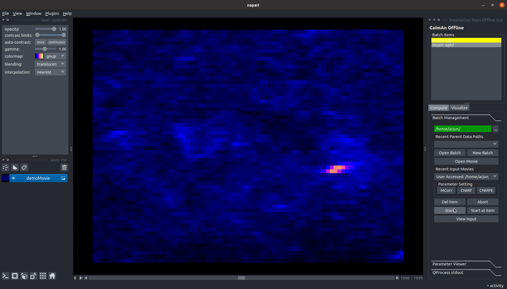

Once an item is completed, it will turn green if it ran successfully, and red if it failed. Once all items
in the batch have been run, the following screen will be shown.

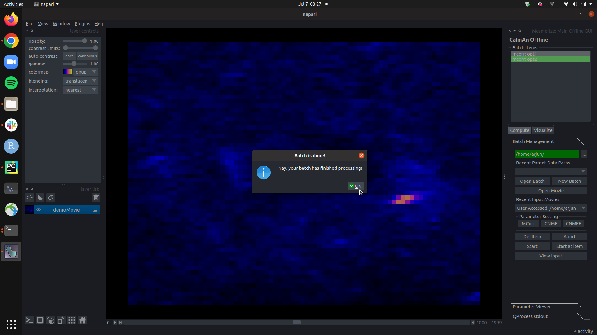

In this case, both items are green, and so ran successfully. To view the outputs of each item, navigate
to the **Visualize** tab of the main gui.

.. figure:: ./images/tutorial/mcorr_visualize_tab.png

There are three sections to the **Visualize** tab: *General*, *Mcorr*, and *CNMF(e)*. The *General*
section allows you to visualize outputs common to all items (Mcorr, CNMF, and CNMFE). These include
projections - can be the mean, max, or standard deviation of pixel intensity across the entire output
movie (in this case, the motion corrected movie) - and correlation image - the average correlation of
each pixel across time to it's neighbours. All of these items are pre-computed, and so load instantly.
Both can also serve as metrics of the success of motion correction.

To open the mean projection for the first item (named *opt1*), select the item in the **Batch Items**
list, select the **mean** option for projections, and then click the **View Projections** button.

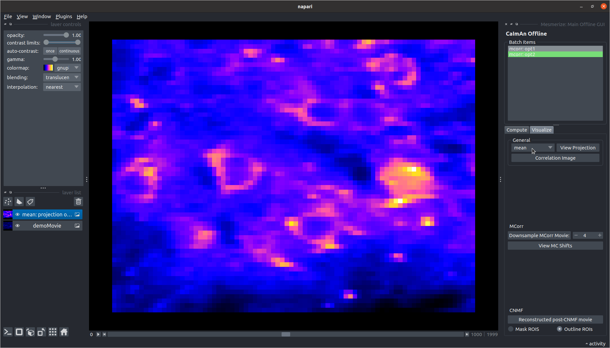

The mean projection image will appear in the main viewer in a layer named *mean: projection opt1*.
To view the correlation image, just click the **Correlation Image** button. This will instantiate
another layer named, in this case, *corr: opt1*.

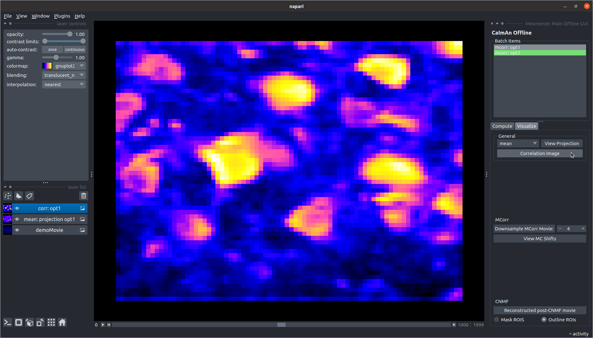

For motion correction specifically, you also have the option of obtaining a downsampled movie - a
rolling average of the motion corrected output for a given window size - and viewing the x and y shifts
performed by the motion correction algorithm to stabilize the movie.
